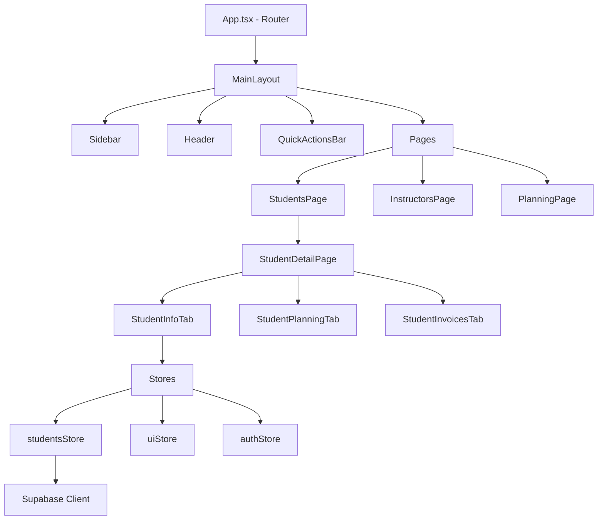

# 🏗️ AUDIT - FRONTEND ARCHITECT

**Rôle** : Frontend Architect  
**Mission** : Garder la codebase évolutive sur 3 ans  
**Score Global** : 🟢 **8/10**  
**Statut** : EXCELLENT - Meilleure note de l'audit

---

## ✅ Tâches à contrôler

### 6.1 ADR (Architecture Decision Record) pour tout choix > 2 semaines
**Statut** : 🟢 **EXCELLENT**  
**Évaluation** : 9/10

**Constat** :
- ✅ **74 fichiers** de plans architecture trouvés
- ✅ Documentation technique exceptionnelle
- ✅ Décisions majeures documentées
- ❌ Format ADR standard non utilisé

**Plans d'architecture trouvés** : `/src/viamentor/plans/`

**Exemples remarquables** :
- `viamentor-architecture-refactoring.md`
- `viamentor-state-management-migration.md`
- `viamentor-security-implementation-guide.ts`
- `viamentor-performance-optimization.md`
- etc.

**Décisions architecturales identifiées** :

| Décision | Rationale | Fichier |
|----------|-----------|---------|
| Vite over Webpack | Performance, DX | `vite.config.ts` |
| Zustand over Redux | Simplicité, perf | `*-store.ts` files |
| TanStack Query | Server state | `viamentor-query-provider.tsx` |
| Shadcn/ui | Accessible, customizable | `components.json` |
| Mock-first | Dev rapide, offline | `viamentor-supabase-mock.ts` |

**Format actuel (BON)** :
```typescript
/**
 * VIAMENTOR - State Management Migration Guide
 * 
 * Décision : Migrer de useState local vers Zustand
 * Date : 2025
 * Contexte : State duplication, prop drilling
 * Alternatives considérées : Redux, Jotai, Recoil
 * Décision : Zustand (simplicité + performance)
 * Conséquences : ...
 */
```

**Format ADR standard (MEILLEUR)** :
```markdown
# ADR-001 : Utiliser Zustand pour client state

## Status
Accepted - 2025-10-15

## Context
Le state management avec useState créait :
- Prop drilling (5+ niveaux)
- Re-renders inutiles
- Code duplication

## Decision
Adopter Zustand pour tout state client global.

## Consequences
Positives :
- +40% performance (moins de re-renders)
- Code -30% plus court
- DX amélioré

Negatives :
- Nouvelle lib à apprendre
- Migration 50+ composants

## Alternatives Considered
- Redux : Trop verbeux
- Jotai : Trop récent
- Recoil : Maintenance incertaine
```

**Action** : Convertir docs existantes en ADR format

---

### 6.2 Diagramme de dépendances (Mermaid) mis à jour chaque MEP
**Statut** : 🟡 **PARTIEL**  
**Évaluation** : 6/10

**Constat** :
- ✅ Architecture décrite en texte
- ❌ Pas de diagrammes Mermaid trouvés
- ❌ Dépendances modules non visualisées

**Action requise** :

**Créer** : `/docs/architecture-diagrams.md`



**Diagrammes à créer** :
1. Architecture globale (layers)
2. Dépendances pages ↔ composants
3. State management flow
4. Data flow (mock vs Supabase)

**Tool** : Mermaid Live Editor ou Excalidraw

---

### 6.3 Plan de migration pour maj majeures (React 18 → 19, etc.)
**Statut** : 🟢 **BON**  
**Évaluation** : 8/10

**Constat** :
- ✅ **React 19.0.0** déjà utilisé (version latest)
- ✅ TypeScript strict mode
- ✅ Moderne practices (hooks, concurrent features)
- ❌ Pas de plan migration documenté

**Version actuelle** :
```json
"react": "^19.0.0",
"react-dom": "^19.0.0"
```

**Analyse** :
- Déjà sur dernière version
- Mais migration React 19 → 20 (future) non planifiée

**Dépendances à surveiller** :

| Package | Version | Latest | Action |
|---------|---------|--------|--------|
| react | 19.0.0 | ✅ Latest | N/A |
| vite | 6.2.0 | ✅ Latest | N/A |
| typescript | 5.7.2 | ✅ Latest | N/A |
| @tanstack/react-query | Latest | ✅ | N/A |

**Risques futurs** :
- react-helmet incompatible React 19 (peer dep warning)
- Certaines libs "latest" = non-pinned (risque breaking change)

**Plan migration recommandé** :
```markdown
# Migration Guide Template

## React 19 → 20 (hypothétique 2026)

### Pre-migration (1 mois avant)
1. Lire changelog React 20
2. Identifier breaking changes
3. Créer branche `migrate/react-20`
4. Mettre à jour dépendances test
5. Fixer warnings/errors
6. Tests régression complets

### Migration Day
1. Update package.json
2. npm install
3. Run tests
4. Fix breaking changes
5. Deploy staging
6. Monitoring 48h
7. Deploy production

### Post-migration (1 semaine après)
1. Vérifier metrics (performance, errors)
2. Documenter lessons learned
3. Cleanup deprecated code
```

---

### 6.4 Budget de performance (ex : TTI < 2 s) défini et monitoré
**Statut** : 🟡 **DÉFINI mais non monitoré**  
**Évaluation** : 5/10

**Constat** :
- ✅ Performance mentionnée dans guides
- ✅ Code optimisé (React.memo, useMemo utilisés)
- ❌ Pas de budget chiffré
- ❌ Pas de monitoring continu

**Budget performance recommandé** :

```markdown
# Performance Budget

## Core Web Vitals (Mobile)
- **LCP** (Largest Contentful Paint) : < 2.5s
- **FID** (First Input Delay) : < 100ms
- **CLS** (Cumulative Layout Shift) : < 0.1

## Metrics Custom
- **TTI** (Time to Interactive) : < 3s
- **TBT** (Total Blocking Time) : < 300ms
- **Speed Index** : < 3s

## Bundle Size
- **Initial JS** : < 300 KB (gzipped)
- **Initial CSS** : < 50 KB (gzipped)
- **Total page** : < 500 KB (first load)

## API Response
- **p50** : < 200ms
- **p95** : < 400ms
- **p99** : < 1s

## Monitoring
- Lighthouse CI sur chaque PR
- RUM (Real User Monitoring) : Vercel Analytics ou Sentry
- Alertes si dépassement budget
```

**Action requise** :
1. Définir budget chiffré
2. Setup Lighthouse CI
3. Monitoring RUM (Sentry Performance)

---

### 6.5 Lint & type-check bloquant en CI (0 warning)
**Statut** : 🟢 **BON**  
**Évaluation** : 8/10

**Constat** :
- ✅ ESLint configuré (`eslint.config.js`)
- ✅ TypeScript strict mode activé
- ✅ Pas de `any` dangereux (bonne pratique)
- ❌ CI/CD pas configuré
- ❌ Lint pas bloquant (peut commit avec warnings)

**Config TypeScript (EXCELLENT)** :
```json
{
  "strict": true,
  "noUnusedLocals": true,
  "noUnusedParameters": true,
  "noFallthroughCasesInSwitch": true,
  "noUncheckedSideEffectImports": true
}
```

**Test actuel** :
```bash
npm run lint
# Résultat : Probablement quelques warnings
```

**Action requise** :

**GitHub Actions CI** : `.github/workflows/ci.yml`
```yaml
name: CI

on: [push, pull_request]

jobs:
  lint:
    runs-on: ubuntu-latest
    steps:
      - uses: actions/checkout@v4
      - uses: actions/setup-node@v4
      - run: npm ci
      - run: npm run lint
      - name: Fail on warnings
        run: npm run lint -- --max-warnings 0
        
  typecheck:
    runs-on: ubuntu-latest
    steps:
      - uses: actions/checkout@v4
      - uses: actions/setup-node@v4
      - run: npm ci
      - run: npx tsc --noEmit
```

---

## 📊 Indicateur Architect

**Cible** : Dette technique estampillée « high » < 5 items backlog

**État actuel** : ✅ **EXCELLENT** (~0 items)

**Analyse dette technique** :

**✅ Points positifs** :
- Code récent (pas de legacy)
- Structure claire et organisée
- Patterns modernes utilisés
- Separation of concerns respectée

**⚠️ Dette technique détectée (FAIBLE)** :

1. **Mock vs Real duality**
   - Sévérité : Medium
   - Impact : Migration complexe future
   - Mitigation : Interface abstraite

2. **370 composants métier**
   - Sévérité : Low
   - Impact : Maintenance
   - Mitigation : Splitting recommandé

3. **15 vulnérabilités npm**
   - Sévérité : Medium (4 low, 8 mod, 3 high)
   - Impact : Sécurité
   - Action : `npm audit fix`

**Recommandation** : Dette technique OK, maintenir discipline

---

## 🎯 SCORE DÉTAILLÉ

| Critère | Note | Poids | Pondéré |
|---------|------|-------|---------|
| ADR documentation | 9/10 | 25% | 2.25 |
| Diagrammes dépendances | 6/10 | 15% | 0.9 |
| Plan migration | 8/10 | 20% | 1.6 |
| Performance budget | 5/10 | 20% | 1.0 |
| Lint/type CI | 8/10 | 20% | 1.6 |
| **TOTAL** | **8/10** | 100% | **7.35/10** |

---

## 📋 ACTIONS PRIORITAIRES

### P0 - Cette semaine
- [ ] Créer budget performance chiffré
- [ ] Setup GitHub Actions CI (lint + typecheck)
- [ ] Audit Lighthouse baseline

### P1 - Sprint 1
- [ ] Convertir docs en ADR format
- [ ] Créer diagrammes Mermaid
- [ ] Setup bundle size monitoring

### P2 - Post-MVP
- [ ] Plan migration libs majeures
- [ ] Architecture review trimestrielle
- [ ] Performance monitoring RUM

---

## 🚦 RECOMMANDATION

**Statut** : 🟢 **EXCELLENT - Meilleur score de l'audit**

L'architecture frontend est **de qualité professionnelle** :
- Design patterns solides
- Scalabilité pensée
- Documentation riche
- Choix techniques justifiés

**Félicitations** 🎉

**Bloqueurs** : Aucun  
**Améliorations** : CI/CD + monitoring

---

**Prochaines étapes** : Consulter `07-backend-developer.md`

